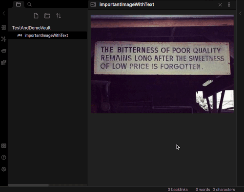

## Obsidian OCR Plugin

With this plugin you can extract the text of image attachments. It will create an annotation document next to the image document. This will contain a link to the image and the extracted text.

If you search for text, that is part of the image, it will yield the annotation document.

**Note**: This is an early version, but it works. It is not in the official list of plugins, so you need to [install it manually](#Manually-installing-the-plugin).

**Note**: The process of extracting the text from the image is not done locally. The plugin uses an online API hosted at https://ocr.taskbone.com.

The image data is stored as long as neccessary for the text extraction and deleted immediately after that.

However, if this is a dealbreaker for you, see [Alternatives](#Alternatives).

## Manually installing the plugin

- Clone this repo
- npm i or yarn to install dependencies
- npm run build
- Copy over `main.js`, `styles.css`, `manifest.json` to your vault `VaultFolder/.obsidian/plugins/taskbone-ocr-plugin/`.
## Alternatives
### Local Tesseract installation
See https://forum.obsidian.md/t/basic-ocr-in-obsidian/18087

Advantages:
* runs locally on your machine

Disadvantages:
* runs locally on your machine
* probably slower
* probably worse results